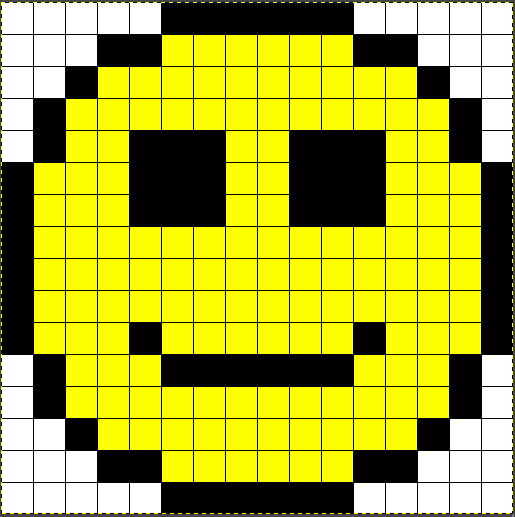

# Image file formats

What's the difference between different graphics formats and why should you care?

## Outline

* There are a wide number of file formats for images (photos or graphics), such as:
  .bmp, .gif, .png, .tiff, .tif, .jpeg, .jpg, .heif, .heic, .svg, .svgz, .ps, .eps, .pdf
* The choice of the format has implications on quality and image size.

## What is a Pixel?

## Raster Graphics
* define the size of an image (e.g. width = 16 pixels, height = 16 pixels)
* store a color intensity for each color (Red Green Blue => RGB) for each pixel
    * typically 8 bit (= 1 byte) for each red, green & Blue
    * 8 bit represent decimal values from 0 to 255; hexadecimal from 00 to FF
    * 3 * 8-bit = 24 bit = ~ 16 million colors can be mixed
* size of the uncompressed image data is:
  width-in-pixels * height-in-pixels * 24-bit

## What is the resolution of a digital image?
Examples:
* common TV resolutions:
    *  640 x  480: Standard-definition TV (SDTV, or "480i")
    * 1280 x  720: High-definition TV (HDTV, "720p")
    * 1920 x 1080: High-definition TV (full-HDTV, "1080p")
    * 3840 x 2160: 4K UHD
* common computer monitor resolutions with 4 x 3 ratio:
    *  640 x  480: VGA  (mid 90's)
    *  800 x  600: SVGA (late 90's)
    * 1024 x  768: XGA  (early 2000s)
    * 1280 x 1024: SXGA

## What is "dpi" / "ppi"
* used for printers and displays
* measures of resolution:
    * dpi: "dots per inch"
    * ppi: "pixels per inch"
    * dpi & ppi can be used interchangeably
* relates the resolution of digital data to the display/print size:
    * an image with 600 x 450 pixes printed at 300 dpi 
      will result in the dimensions 2 inches x 1.5 inches

## Different file formats
### BMP - Windows Bitmap (.bmp)
* raster graphics
* uncompressed
* files can become very large

### GIF - Graphics Interchange Format (.gif)
* raster graphics
* limited to an 8-bit palette, or 256 colors
* lossless compression (LZW)
* suitable for simple graphics that use only a few colors (each in 24-bit RGB color depths)
* supports animations 
* patent expired 2004
* universally supported

### PNG - Portable Network Graphics (.png)
* raster graphics
* open-source alternative to GIF
* lossless compression
* supports *transparency* (alpha-channel)
* supports animations 
* widely supported

### JPEG - Joint Photographic Experts Group (.jpeg, .jpg)
* raster graphics
* lossy compression
* **good** for photos
* **bad** for graphics with large patches of uniform color or
  or sharp edges (logos, clip-art, diagrams)
* Interesting article that explains the JPEG compression: 
  <https://parametric.press/issue-01/unraveling-the-jpeg/>

### HEIF - High Efficiency Image File Format (.heif, .heic)
* designated successor of JPEG
* better compression with same quality 
  = higher quality with same size
* supports 10-bit per color channel
* still quite new and only limited support

### TIFF - Tagged Image File Format (.tiff, .tif)
* raster graphics
* uncompressed as well as lossless and lossy compressions
* supports non-RGB color spaces, e.g. CMYK- (Cyan Magenta Yellow blacK)
* supports 10-bit per color channel
* supports meta-data like resolution (dpi) or print-size
* ==> Used by professionals (photographers, printing, archival)

### SVG - Scalable Vector Graphics (.svg, .svgz)
* Vector graphics
* XML-based -> can embed and be embedded in other types of XML 
  (e.g. HTML, MathML)
* defines geometric shapes (lines, circles, polygons, Bézier curves, text, etc. )
  in an arbitrary coordinate system
* can be scaled without loss quality,
  conversion to raster graphic is done at time of display
* **bad** for photos
* **great** for sketches, logos, diagrams

### PS/EPS - (Encapsulated) PostScript (.ps, .eps)
* PostScript was developed as a "language" for sending data to (laser) printers
* PS is interpreted on the micro-controller within the printer
* defines text and graphics as objects on the page
* very layout-centric
* EPS are objects that can be embedded within a PS file/stream
* can contain text, vector- and raster graphics

### PDF - Portable Document Format (.pdf)
* PDF is based on PostScript
* developed that a document can be viewed and printed on 
  different systems resulting in the exact same layout
* it's very difficult to reconstruct the original document